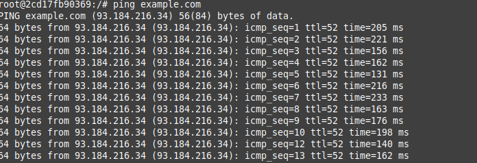

                                                  ---------DOCUMENTAÇÃO ---------


a) Fornecer os arquivos de configuração necessários para cada serviço (DHCP, DNS, Firewall) e explicar suas escolhas 

Na seção 1. Arquivos segue em anexo no repostitório. 

dhcpd.conf

Definição da faixa de variação para atribuição de IP's em outras máquinas
Deinição do nome de dominio


```
subnet 192.168.0.0 netmask 255.255.255.0 {
  range 192.168.0.100 192.168.0.200; # faixa de variação para atribuição de IP's em outras máquinas
  option routers 192.168.0.1;
  option domain-name-servers 8.8.8.8; # acesso ao dominio com ping, por exemplo
  option domain-name "example.com"; #definição do nome da rede (DNS) 
}
```

Observação: Teste com IP. Conexão entre os dois container para garantir a conexão entre as máquinas. 


named.conf

Definicao para funcionamento com a atribuição do DNS definido no DHCP

```
options {
    directory "/var/cache/bind";

    // Seu provedor de DNS público ou outros servidores DNS
    forwarders {
        8.8.8.8; #definicao para funcionamento com a atribuição do DNS definido no DHCP
        8.8.4.4;
    };

    // Definindo as permissões para consultas externas
    allow-query {
        any;
    };
};
```


firewall.sh

Atribuindo permissões para funcionamento do firewall a partir das regras definidas, para os serviços que funcionamentos nas portas selecionadas.


```


#!/bin/bash

# Limpando todas as regras existentes
iptables -F
iptables -X

# Definindo a política padrão como DROP (bloquear tudo)
iptables -P INPUT DROP
iptables -P FORWARD DROP
iptables -P OUTPUT ACCEPT

# Permitindo conexões de loopback
iptables -A INPUT -i lo -j ACCEPT
iptables -A OUTPUT -o lo -j ACCEPT

# Permitindo tráfego relacionado e estabelecido
iptables -A INPUT -m state --state RELATED,ESTABLISHED -j ACCEPT

# Permitindo tráfego DHCP
iptables -A INPUT -p udp --dport 67:68 --sport 67:68 -j ACCEPT

# Permitindo tráfego DNS
iptables -A INPUT -p udp --dport 53 -j ACCEPT
iptables -A INPUT -p tcp --dport 53 -j ACCEPT

```


b) Documentar todo o processo de configuração e os resultados dos testes realizados.
c) Recomenda-se o uso de volumes Docker para persistência de dados, quando necessário.
d) Os participantes devem estar preparados para responder a perguntas sobre suas escolhas de configuração e solução de problemas durante a apresentação do exercício, que será agendada posteriormente.

-> Pontos restantes seguem abaixo. Introdução dos serviços e realização dos testes. 


1. Introdução aos serviços

O projeto visa a criação e implementação de serviços utilizando o Docker. O Docker é uma ferramenta que facilita a criação de contêineres. Os contêineres garantem  isolamento dos serviços, tornando a implantação mais eficiente. 

| SERVIÇOS | DESC |
| ------------- | ------------- |
| DHCP | Configura um servidor DHCP em um ambiente Linux para atribuir automaticamente endereços IP aos dispositivos na rede. O DHCP simplifica a administração da rede, fornecendo configuração dinâmica de endereços IP, gateway padrão, máscara de sub-rede, servidor DNS, entre outros parâmetros de rede. |
| DNS  |Implanta um servidor DNS para resolver nomes de domínio dentro da rede.  |
| Firewall| O firewall é uma medida de segurança essencial para proteger os recursos da rede contra acessos não autorizados. Através do firewall, é possível controlar o tráfego de entrada e saída, permitindo apenas o acesso aos serviços necessários e bloqueando tentativas de acesso malicioso. Considerando a própria tradução literal da palavra do português ao inglês, é uma parede de fogo, que bloqueia acesso definidos em arquivos do serviço.|


2. Testes

 2.1 Testes com DHCP

 - Executando o containers
 - Testando funcionamento do serviço. Serviço DHCP foi iniciado, de acordo com a informação abaixo.


  

   - Testando atribuição DHCP no servidor DNS, com IP e nome de rede (de acordo com o arquivo de configuração)

       


  2.2 Testes com DNS

 - Executando o containers

  


  - Testando atribuição nomes de redes com ping

  

  3.3 Testes com Firewall

 - Executando o container

  


  - Testando se é permitido acessar o serviço de DNS na máquina, de acordo com as permissões estabelecidas

  


